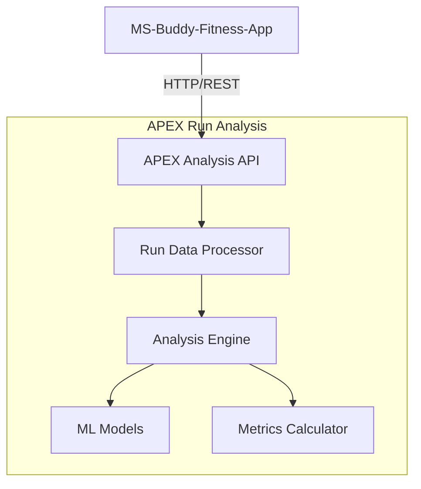
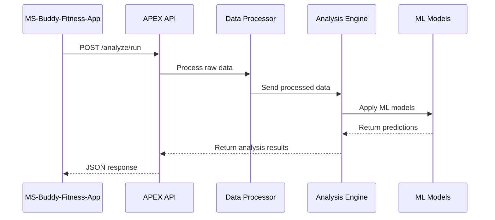

# Architecture Overview

**Who should read this**: System architects, developers, and technical leads
**Estimated reading time**: 15 minutes

## System Architecture

## Component Responsibilities

### Data Processor
- Validates and cleanses incoming run data
- Normalizes data formats
- Handles unit conversions
- Location: `src/analysis/processor.py`

### Analysis Engine
- Coordinates analysis workflow
- Applies machine learning models
- Generates insights and recommendations
- Location: `src/analysis/engine.py`

### ML Models
- Pace prediction
- Performance trending
- Injury risk assessment
- Location: `src/models/`

### Metrics Calculator
- Calculates standard running metrics
- Generates performance indicators
- Location: `src/analysis/metrics.py`

## Data Flow

## Storage and State
- Stateless architecture
- No persistent storage (analyses performed on-demand)
- Caching implemented at API level for performance

## Error Handling
- Input validation at API layer
- Graceful degradation if ML models fail
- Detailed error responses with suggested fixes

## Dependencies
- NumPy: Numerical computations
- Pandas: Data processing
- Scikit-learn: Machine learning models
- FastAPI: REST API framework

## Security Considerations
- API authentication required
- Rate limiting implemented
- Data validation on all inputs
- Sanitization of output data