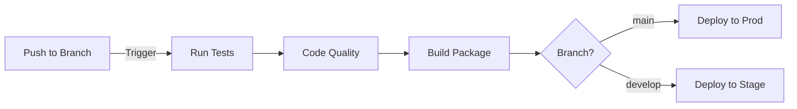

# CI/CD Pipeline

**Who should read this**: DevOps engineers and developers managing deployments
**Estimated reading time**: 12 minutes

## Pipeline Overview



## GitHub Actions Workflow

```yaml
name: CI/CD Pipeline

on:
  push:
    branches: [ main, develop ]
  pull_request:
    branches: [ main ]

jobs:
  test:
    runs-on: ubuntu-latest
    steps:
      - uses: actions/checkout@v2
      - name: Set up Python
        uses: actions/setup-python@v2
        with:
          python-version: '3.9'
      - name: Run Tests
        run: |
          pip install -r requirements.txt
          pytest tests/
```

## Deployment Environments

| Environment | Branch | URL | Description |
|------------|--------|-----|-------------|
| Production | main | api.ms-buddy-fitness.com | Live environment |
| Staging | develop | staging-api.ms-buddy-fitness.com | Pre-production testing |
| Development | feature/* | dev-api.ms-buddy-fitness.com | Development testing |

## Manual Deployment

```bash
# Deploy to staging
.\scripts\deploy.ps1 -environment staging

# Deploy to production
.\scripts\deploy.ps1 -environment production
```

## Rollback Procedure

1. Identify the last stable version
2. Execute rollback script:
```bash
.\scripts\rollback.ps1 -version 1.2.3
```

## Monitoring Deployments

1. Check deployment status:
   - GitHub Actions dashboard
   - Application logs
   - Azure Monitor metrics

2. Verify health endpoints:
```bash
curl https://api.ms-buddy-fitness.com/health
```