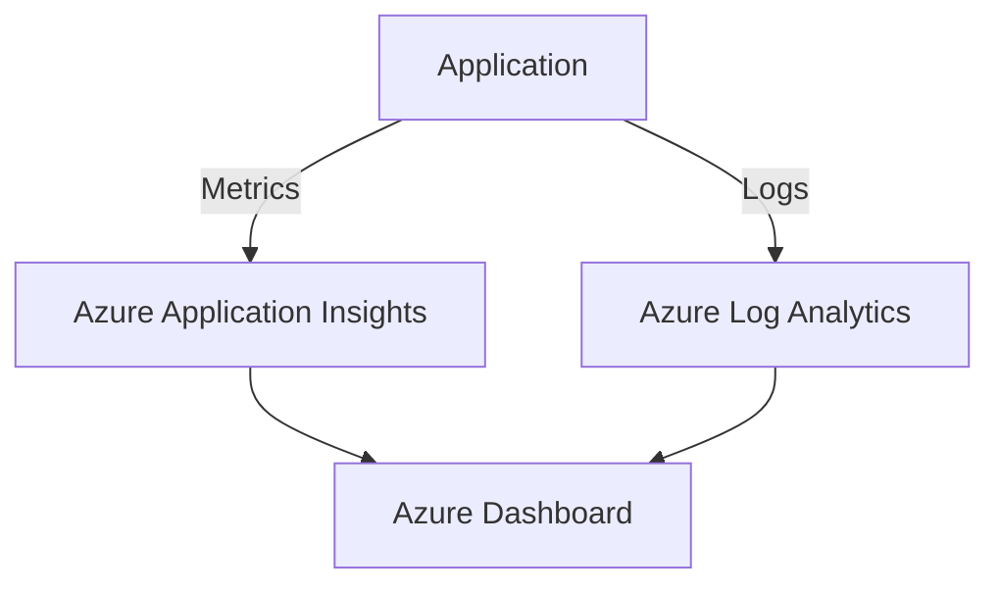

# Performance and Monitoring

**Who should read this**: DevOps engineers and developers optimizing system performance
**Estimated reading time**: 15 minutes

## Performance Metrics

### Key Performance Indicators (KPIs)
- API Response Time: < 200ms
- Analysis Processing Time: < 2s
- Memory Usage: < 512MB per worker
- Error Rate: < 0.1%

### Monitoring Setup



## Performance Optimization

### Caching Strategy
```python
from functools import lru_cache

@lru_cache(maxsize=1000)
def calculate_complex_metrics(run_data_hash: str) -> Dict:
    # Complex calculation logic
    return results
```

### Database Query Optimization
- Use indexed fields
- Implement query caching
- Batch processing for large datasets

## Monitoring Configuration

### Application Insights Setup
```python
// filepath: src/config/monitoring.py
from opencensus.ext.azure.trace_exporter import AzureExporter
from opencensus.trace.samplers import ProbabilitySampler
from opencensus.trace.tracer import Tracer

tracer = Tracer(
    exporter=AzureExporter(
        connection_string="InstrumentationKey=<key>"
    ),
    sampler=ProbabilitySampler(1.0),
)
```

### Health Checks
```python
@app.get("/health")
async def health_check():
    return {
        "status": "healthy",
        "version": "1.0.0",
        "dependencies": {
            "database": check_db_connection(),
            "cache": check_cache_connection()
        }
    }
```